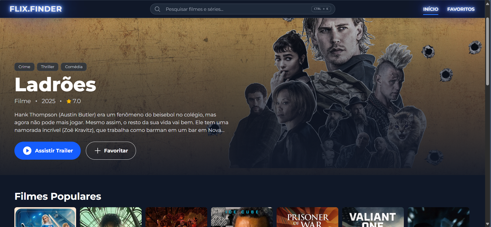

# 🎬 FLIX.FINDER 🍿  

Plataforma de descoberta de **filmes e séries** construída com **React + TypeScript** e integrada à **API do TMDB**. O projeto simula a interface de um serviço de streaming, explorando conceitos de **componentização**, **fetching assíncrono com TanStack Query** e **UI moderna com Tailwind CSS**.  

---

## 📸 Demonstração  

> Aqui está o **FLIX.FINDER** em ação:

  

---

## ✨ Funcionalidades  

- Página inicial com título em destaque e seções horizontais (Populares, Top 10).  
- Busca global (`Ctrl + K` ou Header) com resultados de filmes e séries.  
- Página de detalhes imersiva (poster *full-screen*, elenco, diretores, recomendações).  
- Sistema de favoritos persistente no `LocalStorage`.  
- Botão para assistir trailers diretamente no YouTube.  
- Navegação unificada entre filmes (`/movie/:id`) e séries (`/tv/:id`).  

---

## 🛠️ Tecnologias  

- **React (Vite) + TypeScript**  
- **Tailwind CSS**  
- **TanStack Query (React Query)**  
- **React Router DOM**  
- **Radix UI** (modal de busca)  
- **TMDB API**  

---

## ⚙️ Como Rodar  

### Pré-requisitos  
- Node.js (LTS recomendado)  
- Conta e chave de API no [TMDB](https://www.themoviedb.org/)  

### Passos  

1. Clone o repositório:  
   ```bash
   git clone https://github.com/leonardobe/flix-finder-project.git
   
   cd flix-finder-project
   ```

2. Instale as dependências:  
   ```bash
   npm install
   ```

3. Configure o `.env`:  
   - Já existe um arquivo **`.env.example`** com o formato esperado.  
   - Crie um `.env` na raiz e adicione sua chave do TMDB:

     ```
     VITE_TMDB_API_KEY=SUA_CHAVE_AQUI
     ```

4. Execute o servidor de desenvolvimento:  
   ```bash
   npm run dev
   ```
---

## 📄 Licença  

Projeto desenvolvido por [Leonardo Curtis](https://github.com/leonardobe/) para fins de estudo/prática e não possui vínculo oficial com a plataforma TMDB. 
